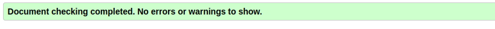

# Whether Weather

Developer: Kristian Colville


[Visit Whether Weather](https://whetherweather96.netlify.app/)

## Table of Contents

* [Project Goals](#project-goals)
  * [Personal Goals](#personal-goals)
* [User Experience (UX)](#user-experience-ux)
  * [Target Audience](#target-audience)
* [Design](#design)
  * [Color Scheme](#color-scheme)
  * [Typography](#typography)
  * [Layout](#layout)
  * [Icons](#icons)
  * [Use of Bulma](#use-of-bulma)
* [Technologies &amp; Tools](#technologies--tools)
* [Languages Used](#languages-used)
* [Features](#features)
  * [Proof of Concept 1](#proof-of-concept-1)
  * [Proof of Concept 2](#proof-of-concept-2)
  * [Proof of Concept 3](#proof-of-concept-3)
  * [Release 1](#release-1)
  * [Release 2](#release-2)
  * [Release 3](#release-3)
* [Data](#data)
* [Testing](#testing)
  * [Google Lighthouse Results](#google-lighthouse-results)
* [Bugs](#bugs)
  * [Bug Details](#bug-details)
* [Releases](#releases)
* [Development &amp; Deployment](#development--deployment)
  * [Version Control](#version-control)
  * [Cloning the Repository](#cloning-this-repository)
  * [Netlify](#netlify)
* [Credits](#credits)

---

## Project Goals

**Whether Weather** has launched a powerful new API that delivers real-time weather data and 7-day forecasts for cities around the world using cutting-edge satellite technology. The goal of this project is to build a modern, responsive web application that consumes this API and presents the weather data in an intuitive and user-friendly way.

The application must:

- Display current and forecasted weather information clearly
- Adapt seamlessly across devices with responsive design
- Allow users to customize their preferences and view different cities
- Present weather information using readable formats and visual icons

This project demonstrates how to take complex weather data and transform it into an accessible, interactive, and visually appealing user experience.

### Personal Goals

As the developer of this project, I was hired by **Whether Weather** to design and build their first official web application. My personal goals for this project included:

- Building a 7-day weather forecast application from the ground up
- Applying best practices in frontend development and UI/UX design
- Working with APIs to dynamically fetch, process, and display weather data
- Managing user preferences using Local Storage for a more personalized experience
- Implementing intuitive navigation and ensuring mobile responsiveness
- Get outside my comfort zone and utilising the Bulma CSS3 framework.

This project was not only a technical challenge but also an opportunity to shape the initial user experience of Whether Weather’s digital presence and deliver real value to a wide audience.

### Target Audience

This weather application is designed for **everyone who needs quick, reliable weather updates** in a clean and easy-to-understand format.

Whether you're:

- A busy commuter checking the forecast before heading out
- A parent planning a family outing
- A student choosing what to wear for school
- Or even a young child curious about the weather icons and little faces on them...

The interface is built to be **simple, colorful, and user-friendly**, with minimal clutter and clear visuals. It works across all modern devices, making it ideal for users of all ages — from tech-savvy adults to kids who enjoy a more visual, icon-based experience.

In short, this app is for **anyone who wants the weather, fast and frustration-free**.

---

## Design

The design of the application focuses on clarity, simplicity, and ease of use for users of all ages. Inspired by the assignment guidelines, the initial releases followed a recommended layout structure. In later iterations, visual improvements were made to align with the new icon set and user experience goals.

### Color Scheme

The entire color palette was sourced directly from [Bulma](https://bulma.io/documentation/modifiers/color/), ensuring consistency, accessibility, and a professional look. The following color classes were used throughout:

- `is-primary` and `is-info` for highlighting important areas and weather summaries
- Subtle uses of `is-warning` and `is-danger` to indicate forecast alerts or special weather conditions
- A **white navigation bar** (`has-background-white`) to maintain a clean header
- A **soft off-white background** for the main body for reduced eye strain
- A **light grey footer** to subtly separate the bottom section from the rest of the content

These choices collectively provide a visually distinct and easy-to-navigate interface.

### Typography

Rather than manually selecting fonts, the project uses **Bulma’s built-in typography system**. Classes like `.title`, `.subtitle`, and `.content` offer modern, responsive text styling out-of-the-box.

The default typeface is likely a clean, web-safe sans-serif (inherited from Bulma), offering excellent legibility and a contemporary look. This helped maintain consistency without introducing extra font dependencies.

### Layout

The structure of the application is built entirely on **Bulma’s column and container system**, which allows for:

- Responsive, grid-based layouts
- Easy centering and spacing of weather cards, city information, and forecasts
- Flexibility to adjust content placement for both desktop and mobile views

The **card components** were also leveraged for grouping related content such as daily forecasts and hourly breakdowns.

### Icons

| Logo                                                          | Description     |
| ------------------------------------------------------------- | --------------- |
|  | Sunny           |
|  | Windy           |
|  | Raining        |
|    | Rain Drizzle    |
|  | Partially Cloudy |
|   | Snow            |
|  | Storm           |
|    | Fog             |
|  | Precipitation   |
|  | Clock           |
|  | Temperature     |
|  | Left Chevron    |
|  | Right Chevron   |
|       | Logo            |
|       | Logo-brand      |


In the latest release, new weather icons were added from **Freepik** via **Flaticon**, greatly enhancing the visual appeal and clarity of the forecasts. The layout was slightly adapted to better showcase these icons, ensuring:

- Each day’s weather is quickly recognizable by image
- Icons remain readable on all screen sizes
- A more friendly and inviting experience, particularly for younger users
- To complete the consistency the logo was updated using a free photo shop tool called **Photopea**, ensuring all icons were matching.

### Use of Bulma

A key goal during UI/UX design was to **minimize custom CSS**. By relying on Bulma’s utilities for spacing, alignment, and component styling, the project:

- Reduced development time. I estimate 20% time saved from my experience.
- Ensured consistent design patterns
- Simplified maintenance and future updates

Custom styling was only applied when absolutely necessary, keeping the overall codebase clean and lightweight.
Together, these design choices support a functional, responsive, and visually pleasing application that works well for a wide audience while remaining developer-friendly.

---

## Technologies & Tools

- [HTML](https://developer.mozilla.org/en-US/docs/Web/HTML) - The standard markup language used to structure the web pages and content of the application.
- [CSS3](https://developer.mozilla.org/en-US/docs/Web/CSS ) - Used for styling the application, enhancing layout, colors, and responsiveness.
- [JavaScript](https://developer.mozilla.org/en-US/docs/Web/JavaScript) - The primary programming language powering the web app’s interactivity.
- [Bulma CSS Framework](https://bulma.io/) - A modern, responsive CSS framework used for layout, typography, and UI components to minimize custom styling.
- [Flaticon](https://www.flaticon.com/) - Source for the weather icons used in the app, providing clear and attractive visuals for weather conditions.
- [Freepik](https://www.freepik.com/) - The platform from which Flaticon icons were sourced, offering a wide range of free and premium graphic resources.
- [Photopea](https://www.photopea.com/) - An online photo editing tool used to customize and optimize the logo for the project.
- [Bulma Toggle extension](https://cdn.jsdelivr.net/npm/bulma-switch@2.0.4/dist/css/bulma-switch.min.css) - A Bulma extension utilized for toggle switches in the UI, improving user preference controls.
- [Netlify](https://www.netlify.com/) - The hosting platform used to deploy and serve the application live with continuous integration support.
- [Eleventy](https://www.11ty.dev/) - A static site generator used to build and manage the project’s frontend templates and content.
- [Nunjucks](https://mozilla.github.io/nunjucks/) - A templating engine integrated with Eleventy to enable reusable HTML templates and efficient page generation.
- [Favicon](https://favicon.io/) - A favicon generator for the web app.

---

## Features

### Proof of Concept 1

- **Weather code mapped to correct weather showing icon**
Visual weather icons display the current conditions based on API weather codes.
- **Weather code mapped to WMO specification for accuracy**
Codes follow the World Meteorological Organization standards for consistency.
- **Display City Name**
Shows the selected city's name prominently for clarity.
- **Max Temperature showing**
Highlights the highest temperature expected each day.
- **Max Wind showing**
  Displays the maximum wind speed forecast for the day.

### Proof of Concept 2

- **Adding current hours forecast**
Detailed hourly forecast starting from the current hour.
- **Correctly mapping hourly weather code to UTC Dublin**
Ensures hourly weather aligns with UTC time adjusted for Dublin.
- **Correct hour taken from the browser**
Uses the user's local browser time to display accurate hourly data.

### Proof of Concept 3

- **7 Day weather summary**
Provides a concise 7-day forecast overview.
- **Weather Codes mapped correctly and displaying icon depending on the forecast**
Shows forecast icons matching daily weather codes for clarity.
- **Showing Additional Weather information for wind and temperature**
Includes detailed wind speeds and temperature ranges in the forecast.

### Release 1

- **User experience improved**
UI and performance enhancements using Bulma to reduce custom CSS.
- **Navigating to the city view**
Easy transitions to detailed city weather views.
- **Navigating to dashboard**
Centralized dashboard to overview multiple cities.
- **Utilising URL paths and parameters**
Dynamic routing using URL paths and query parameters.

### Release 2

- **User preferences interface on the settings page**
Settings UI for customizing units and city selections.
- **Preferences stored in Local Storage**
Saves user settings locally for persistence.
- **Clear and simple navigation system**
Intuitive navigation between dashboard, city, and settings.
- **Dashboard renders dynamically based on preferences**
Hides or shows tabs like "Favourites" depending on saved data.
- **Preferences cleared when browser cache is wiped**
Local Storage resets when browser data is cleared.

### Release 3

- **Responsive navigation with JavaScript hamburger menu**
Mobile-friendly hamburger menu toggles navigation visibility.
- **Additional weather info such as precipitation probability**
Displays chances of rain or other precipitation.
- **Dynamic colors for weekly forecast backgrounds**
Background colors change sequentially to represent the next 7 days.
- **City Switcher toggles left and right on city focus page**
Users can browse cities using intuitive toggle controls.
- **Dynamic extraction of city data using '_daily' keys**
Automatically parses API data for city-specific daily forecasts.
- **Improved UI with updated weather icons**
More appealing and friendly icons reflecting refined weather data.

---

## Data

The `weather_data` provided in the assignment was used to mimic real API data. This static dataset allowed for consistent development and testing of the weather forecasting features before integrating with a live API.

---

## Testing

### Google Lighthouse Results

Dashboard


City Focus


Settings


HTML Validation


CSS3 Validation

---

## Bugs

| ID | Issue                                  | Description                                           | Solution                                                    | Release Fixed |
| -- | -------------------------------------- | ----------------------------------------------------- | ----------------------------------------------------------- | ------------- |
| 1  | Local Storage Reset                    | Preferences reset when all were turned off.           | Set default state when loading serializer to prevent reset. | Release 3     |
| 2  | Null Listener Check in City Focus View | Null check on listener done too late, causing errors. | Moved null check into the event listeners.                  | Release 3     |

### Bug Details

**Bug #1:**
The local storage serializer lacked default data initialization. This caused the city and weather preferences to reset unexpectedly when users cleared all settings. Adding a default data fallback fixed this issue.

**Bug #2:**
In the city focus view, event listeners were checked for null too late, after the view had already initialized but before listeners were attached. This led to runtime errors when navigating between views. Reordering the null check to happen earlier resolved the problem.

---

## Releases

### Git Plan

This repository tracks the iterative development of the weather forecasting website assignment for Whether Weather.

The project is organized into multiple delivery stages, from **Proof-of-Concepts (POC)** to full **Releases**. Branches and commits document each phase of the work.

Common Git commands used to manage branches:

```bash
git checkout -b branch_name
git push --set-upstream origin branch_name
git checkout main
git pull origin branch_name
git push origin main
```

### Strategy

The assignment requires submitting multiple iterations of the same project:

- **POC 1** ➔ **POC 3**
- **Release 1** ➔ **Release 3**

My approach to development includes:

- Initializing the repository with a solid foundation.
- Creating a dedicated branch for each POC and Release following the assignment structure as a guideline.
- Building each branch on the previous one, with meaningful, isolated commits representing deliverable checkpoints.
- Using **Eleventy** with **Nunjucks** for templating, **Bulma** for styling, and implementing a clear **MVC architecture** in JavaScript.

---

### Timeline

| Milestone                 | Date                 |
| ------------------------- | -------------------- |
| Project Start             | April 6, 2025        |
| Expected Final Submission | Week of May 18, 2025 |
| Approximate Duration      | 6 weeks              |

---

### Git Scope & Branching

| Branch   | Description                   |
| -------- | ----------------------------- |
| `main` | Stable, release-ready version |
| `poc1` | Proof of Concept 1            |
| `poc2` | Proof of Concept 2            |
| `poc3` | Proof of Concept 3            |
|          |                               |
| `rel1` | Release 1: Dashboard          |
| `rel2` | Release 2: Preferences        |
| `rel3` | Release 3: Impress Us         |

### Release Results

#### Proof of concept 1:

Feature Focus:

- **Weather code mapped to correct weather showing icon**
The app displays a visual icon that corresponds to the current weather condition based on the weather code provided by the API.
- **Weather code mapped to WMO specification for accuracy**
Weather codes are interpreted using the official WMO (World Meteorological Organization) standard to ensure consistency and accuracy across all regions.
- **Display City Name**
The currently selected city's name is shown prominently at the top of the weather view for user clarity.
- **Max Temperature showing**
The interface highlights the maximum expected temperature for the day to help users plan accordingly.
- **Max Wind showing**
The maximum wind speed for the day is displayed, useful for weather-sensitive activities or alerts.


Proof of concept 2:

Feature Focus:

- **Adding current hours forecast**
The app includes a detailed hourly forecast starting from the current hour, providing users with short-term weather insights.
- **Correctly mapping hourly weather code to UTC Dublin**
Hourly weather codes are aligned with UTC time, adjusted specifically for the Dublin time zone to ensure accurate local forecasts.
- **Correct hour taken from the browser**
The application detects the user's current local time directly from the browser to determine which hourly data to show first.


#### Proof of Concept 3:

Feature Focus:

- **7 Day weather summary**
A concise overview of the weather forecast for the next 7 days, helping users plan ahead with daily temperature and condition previews.
- **Weather Codes mapped correctly and displaying icon depending on the forecast**
Forecasted weather conditions are visualized using icons that match standardized weather codes, ensuring clear and intuitive representation.
- **Showing Additional Weather information for wind and temperature**
Each day includes expanded details such as expected wind speeds and temperature ranges to provide a more complete forecast.


#### Release 1:

Feature Focus:

- **User experience improved**
Various UI and performance enhancements were made to streamline interactions and improve the overall feel of the application. More bulma classes added to help reduce extra CSS usage.
- **Navigating to the city view**
Users can easily transition to the city-specific weather view to see detailed forecasts and weather information.
- **Navigating to dashboard**
A centralized dashboard view allows users to access an overview of multiple cities or saved weather data quickly.
- **Utilising URL paths and parameters**
The app leverages dynamic URL paths and query parameters to handle routing and state management between views.


#### Release 2:

Feature Focus:

- **User preferences user interface on the settings page**
A dedicated UI on the settings page allows users to customize their weather viewing preferences such as temperature units and city selections.
- **Preferences stored in Local Storage within the browser**
User preferences are saved locally using the browser's Local Storage, ensuring settings persist between sessions.
- **Clear and simple navigation system**
The application includes an intuitive navigation structure, allowing users to switch between views like dashboard, city details, and settings with ease.
- **Dashboard renders differently depending on preferences saved. No preferences and favourites tab disappears.**
The dashboard dynamically adjusts its layout based on stored user preferences; if none are present, certain elements like the "Favourites" tab are hidden.
- **Preferences are wiped when the browser cache is cleared**
Since preferences are stored locally, clearing the browser cache or site data will remove all saved user settings.


#### Release 3:

Feature Focus:
--------------

- **Responsive navigation and hamburger connected using JavaScript to show on mobiles**
A JavaScript-driven hamburger menu enables responsive navigation on smaller screens, improving usability on mobile devices.
- **Additional weather information such as precipitation probability**
The interface now includes precipitation probability, giving users a more comprehensive view of upcoming weather conditions.
- **Colors of the weekly forecast backgrounds change and the sequence ensures the next 7 days are shown in linear form**
The 7-day forecast is presented with dynamic background colors that visually represent each day in sequence, improving clarity and flow.
- **City Switcher can be toggled left and right on the city focus page to switch cities**
Users can easily browse through different cities using a left/right toggle, enhancing the multi-city browsing experience.
- **City data is extracted dynamically without manual effort from weather data by using '_daily' keys in the object**
The system automatically identifies and extracts city-specific weather data from structured API responses by recognizing `_daily` keys.
- **User interface improved further by updating the original weather code data found so that the icons could make it friendlier and more appealing**
Weather icons have been updated to more accurately reflect conditions and enhance the visual appeal of the app based on improved weather code handling.


## Development & Deployment

### Version Control

I used [Visual Studio Code](https://code.visualstudio.com/) as a local repository and IDE & [GitHub](https://github.com/) as a remote repository.

1. Firstly, I needed to create a new repository on Github [web-2-setu](https://github.com/KristianColville1/web-2-setu).
2. I opened that repository on my local machine by copying the URL from that repository and cloning it from my IDE for use.
3. Visual Studio Code opened a new workspace for me.
4. I created files and folders to use.
5. To push my newly created files to GitHub I used the terminal by pressing Ctrl + shift + `.
6. A new terminal opened and then I used the below steps.

   - `git add (name of the file)` *This selects the file for the commit*
   - `git commit -m "Commit message: (i.e. Initial commit)"` *Allows the developer to assign a specific concise statement to the commit*
   - `git push` *The final command sends the code to GitHub*

### Cloning this Repository

If you would like to clone this repository please follow the bellow steps.

Instructions:

1. Log into GitHub.
2. Go to the repository you wish to clone.
3. Click the green "Code" button.
4. Copy the URL provided under the HTTPS option.
5. Open your preferred IDE with Git installed.
6. Open a new terminal window in your IDE.
7. Enter the following command exactly: `git clone the-URL-you-copied-from-GitHub`.
8. Press Enter.

### Netlify

I used [Netlify](https://www.netlify.com/) for deploying my project.

1. First, I created an account on [Netlify](https://www.netlify.com/).
2. I then connected my GitHub repository to Netlify by clicking the "New site from Git" button on the dashboard.
3. I selected GitHub as my provider and authorized Netlify to access my GitHub account.
4. I chose the repository I wanted to deploy from the list of my available options.
5. I made sure to specify the build command and publish directory. This project utilises the **_site** directory for static build.
6. After confirming the settings, I clicked "Deploy site."
7. Netlify then started building and deploying the project, and once finished, it provided a URL for accessing the live site.

Netlify also automatically set up continuous deployment. Any new changes pushed to the main repository will trigger a new deployment on Netlify.

## Credits

* Bulma extension for toggle switch
* [Initial weather code images](https://gist.github.com/stellasphere/9490c195ed2b53c707087c8c2db4ec0c) that helped with initial start of project until release 3 weather code images.
* Icons used where created by the author **Freepik** on **Flaticon**.
